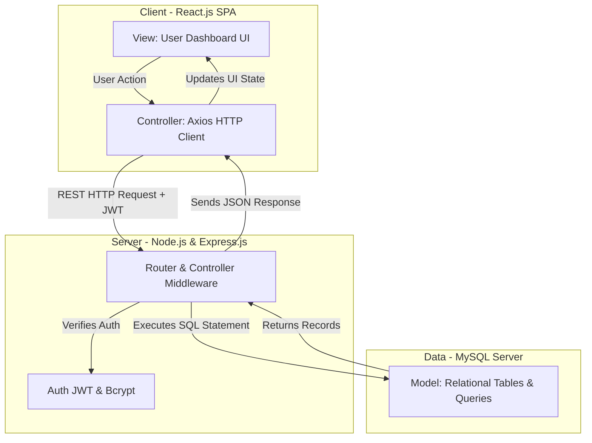

# 🏠 HostelHub — Smart Hostel Management System Project Report

---

## 📄 PROJECT TITLE
**HOSTELHUB: A SEMANTIC, FULL-STACK SMART HOSTEL MANAGEMENT SYSTEM WITH SECURE ROLE-BASED ACCESS CONTROL AND REAL-TIME RELATIONAL DATABASE OPERATIONS**

**Academic Level:** Undergraduate (B.E./B.Tech) DBMS & Full-Stack Development Laboratory Project  
**Author:** Siddalingesh Karadi  
**USN:** 1RV22CS045  
**Department:** Computer Science and Engineering  
**Academic Year:** 2025 - 2026  

---

## 📑 TABLE OF CONTENTS
1. [Chapter 1: Introduction](#chapter-1-introduction)
   - 1.1 Project Overview
   - 1.2 Purpose and Objectives
   - 1.3 Scope of the System
   - 1.4 Introduction to Core Web Technologies
2. [Chapter 2: System Requirement Specifications (SRS)](#chapter-2-system-requirement-specifications-srs)
   - 2.1 Hardware Requirements
   - 2.2 Software Requirements
3. [Chapter 3: System Analysis & Design](#chapter-3-system-analysis-design)
   - 3.1 Existing System vs. Proposed System
   - 3.2 System Architecture (MVC & Client-Server)
   - 3.3 Database Relational Schema & Table Definitions (18 Tables)
   - 3.4 Entity-Relationship (ER) Design Concepts & Constraints
4. [Chapter 4: System Implementation & Modules](#chapter-4-system-implementation-modules)
   - 4.1 Student Module
   - 4.2 Warden/Staff Module
   - 4.3 Administrator Module
   - 4.4 Security Guard Module
   - 4.5 Additional Roles (Housekeeper)
5. [Chapter 5: Key SQL Queries & DBMS Execution (Viva Cheat Sheet Ready)](#chapter-5-key-sql-queries-dbms-execution)
   - 5.1 System Inspection & Auditing Queries
   - 5.2 Core Transaction & Join Queries
   - 5.3 Advanced Aggregations & Dashboard Queries
   - 5.4 Complex Nested Subqueries & Referential Integrity Audits
6. [Chapter 6: Conclusion & Future Scope](#chapter-6-conclusion-future-scope)

---

## 🏛️ CHAPTER 1: INTRODUCTION

### 1.1 Project Overview
**HostelHub** is a web-based smart hostel management application designed to streamline hostel operations, room allocations, and student services. This application is constructed keeping client-server architecture in mind, using a React.js GUI for the client and a Node.js/Express.js backend for administrative control. The project also shows modern, robust methods for real-time room booking, leave application tracking, fee status audits, and dynamic room capacity checks.

The database required for the application and details of the method used will contain detailed records for various hostel entities, including student details (name, USN, course, branch, phone, room allocation), room details (room number, block, floor, capacity, occupancy status), fee details (due dates, outstanding amounts, transaction logs), and administrative logs (attendance logs, leave details, complaints, mess menu). Registered students can view their room info, pay fees, file complaints, and request leaves. Administrators and wardens can manage the student directory, room allocations, and resolve queries dynamically.

---

### 1.2 Purpose and Objectives
The primary purpose of **HostelHub** is to replace manual paper registers or uncoordinated spreadsheets with an integrated, secure, and transactional DBMS dashboard.
The core objectives of the system are:
1. **Automated Resource Optimization**: Track room capacity and occupancy in real-time, preventing overbooking and facilitating dynamic allocation.
2. **Transparent Financial Workflows**: Enable clear invoice generation, payment proof submission, and warden-level approvals of outstanding dues.
3. **Structured Grievance Redressal**: File complaints under distinct categories (electrical, plumbing, internet, cleaning) with priority levels, ensuring direct assignment and accountability.
4. **Enhanced Security & Accountability**: Track student entries/exits via gate logs, log staff check-ins, record daily student attendance, and assign shift duties to security guards.
5. **Decentralized Communication**: Provide notice boards, broadcast emergency alerts, and enable private messaging between students, wardens, and administrators.

---

### 1.3 Scope of the System
HostelHub is designed for educational institutes, professional hostels, and co-living facilities. Its operational scope covers:
- **Transactional Integrity**: Ensures that a student cannot be allocated a room that is already at full capacity.
- **Role-Based Access Control (RBAC)**: Guarantees that only authorized roles (Admin, Warden, Security, Housekeeper, Student) can access or edit respective database records.
- **Relational Integrity**: Deletions or updates of user records propagate down to profile pages and active logs seamlessly through cascading foreign keys.

---

### 1.4 Introduction to Core Web Technologies
In the following sections, a brief introduction about the HTML, JavaScript, CSS, React, Tailwind CSS, Node.js, and MySQL database used in the website structure is discussed.

#### 1.4.1 HTML (HyperText Markup Language)
HTML5 serves as the skeleton of the frontend interface. It utilizes semantic tags (such as `<header>`, `<nav>`, `<main>`, `<section>`, and `<footer>`) to provide meaningful structural blocks for the user dashboard. Input forms are embedded with standard constraints (required, email patterns, type definitions) to validate inputs before sending them to the backend server.

#### 1.4.2 CSS & Tailwind CSS
Tailwind CSS is a utility-first CSS framework utilized to design a premium, modern user interface. It eliminates the need for writing raw stylesheet files by providing pre-defined utility classes directly in the markup. It provides:
- **Responsive Designs**: Adaptive layouts using breakpoints (`sm:`, `md:`, `lg:`) to ensure compatibility with mobile phones, tablets, and desktop displays.
- **Visual Depth**: Beautiful glassmorphism, smooth CSS transitions, modern gradients, and micro-animations for interactive cards and state indicators.
- **Color Systems**: Harmonic dark and light mode styling to prevent eye strain during nocturnal usage.

#### 1.4.3 JavaScript & React.js
JavaScript (ES6+) handles both frontend client-side rendering and backend server-side logic. On the frontend:
- **React.js**: A component-based JavaScript library used to compile reactive user interfaces. It utilizes a Virtual DOM to re-render only the components whose states change, ensuring fast navigation.
- **React Router**: Implements Single Page Application (SPA) routing, creating smoothTransitions without reloading pages.
- **Axios**: Handles asynchronous HTTP requests to retrieve data from the backend REST API endpoints.

#### 1.4.4 Node.js & Express.js
The backend environment is built on Node.js, which enables executing JavaScript outside the browser.
- **Express.js**: A lightweight, fast web framework for Node.js used to build robust RESTful APIs. It manages API endpoints (GET, POST, PUT, DELETE), handles request parameters, parses JSON payloads, and runs middleware functions (e.g., JWT verification, request logging).
- **JWT (JSON Web Tokens)**: Secures communication by encoding user payload into a signed cryptographic token, which is passed in HTTP headers for state management.
- **Bcrypt.js**: Secures user passwords by hashing them with a salt algorithm before saving them in the MySQL database.

#### 1.4.5 MySQL Database
MySQL is the relational database engine selected for data storage. It offers:
- **Data Integrity**: Supports ACID (Atomicity, Consistency, Isolation, Durability) transactions, ensuring that multi-step operations (e.g., student booking and room occupancy increment) either succeed completely or roll back together.
- **Structured Schema**: Enforces strict datatype boundaries (VARCHAR, INT, ENUM, DECIMAL, TIMESTAMP, DATE) and indexes primary keys to enable swift retrieval of analytical metrics.

---

## ⚙️ CHAPTER 2: SYSTEM REQUIREMENT SPECIFICATIONS (SRS)

### 2.1 Hardware Requirements
The system requires standard computational resources to execute and run the databases:

*   **Server / Developer Environment:**
    *   **CPU**: Multi-core processor (Intel Core i3/i5/i7 or AMD equivalent, 2.0 GHz+).
    *   **RAM**: 8 GB minimum (16 GB recommended for running databases, compilers, and local dev servers concurrently).
    *   **Hard Disk Space**: 5 GB of free space for dependencies, local databases, and temporary build files.
*   **Client / End-User Device:**
    *   **Device**: Any modern smartphone, laptop, desktop, or tablet.
    *   **Display Resolution**: Minimum 1024x768 pixels for optimal dashboard visibility.
    *   **Network**: Broadband internet connection or local LAN access to host server.

---

### 2.2 Software Requirements
The project relies on open-source runtime environments, libraries, and tools:

*   **Operating System**: Microsoft Windows 10/11, macOS, or Linux (Ubuntu/Debian).
*   **Database Server**: MySQL Server v8.0 or MariaDB v10.4+.
*   **Runtime Environment**: Node.js v16.x or newer, NPM (Node Package Manager) v8.x+.
*   **Web Browser**: Google Chrome, Mozilla Firefox, Microsoft Edge, or Safari with JavaScript execution enabled.
*   **Development Tools**: Visual Studio Code, Git (for source control), Command Prompt / PowerShell, MySQL Workbench or phpMyAdmin (optional database clients).

---

## 🎨 CHAPTER 3: SYSTEM ANALYSIS & DESIGN

### 3.1 Existing System vs. Proposed System

| Feature | Existing Manual / Spreadsheet System | Proposed HostelHub System |
| :--- | :--- | :--- |
| **Room Allocation** | Manual entries in paper registers. Highly prone to over-allocation or double booking of beds. | Real-time query evaluation checks room capacity constraints before allowing allocations. |
| **Complaints Logging** | Written slips submitted to a warden desk. Slips get lost, leading to poor resolution times. | Digital lodging categorized by urgency. Tracks status from 'Pending' through 'In-Progress' to 'Resolved'. |
| **Fee Audits** | Checking bank receipts manually against lists. Dues are calculated by hand. | Auto-generated invoices, digital transaction proof uploads, and automated pending fee calculation. |
| **Security Auditing** | No digital records of student movement. Paper logbooks at gates are incomplete or illegible. | Digital Gate Log matching students to security guards on duty with timestamped logs. |
| **Leave Approvals** | Written application forms signed manually. Delays due to physical unavailability of wardens. | Automated digital submission showing reason, destination, and dates. Wardens approve with a single click. |

---

### 3.2 System Architecture
HostelHub is designed around the **client-server paradigm** structured as a **Model-View-Controller (MVC)** implementation:



---

### 3.3 Database Relational Schema & Table Definitions (18 Tables)
The system operates on an integrated schema containing 18 relational tables. Below is the detailed definition of each table, including attributes, data types, keys, and foreign relationships.

#### 1. `users`
Stores fundamental security and identity credentials for all actors accessing the system.
- **id** (INT, Primary Key, Auto Increment): Unique identifier of the user.
- **name** (VARCHAR(100), Not Null): Full name of the user.
- **email** (VARCHAR(100), Unique, Not Null): Login email address.
- **password** (VARCHAR(255), Not Null): Cryptographically hashed password.
- **role** (ENUM('admin', 'student', 'warden', 'housekeeper', 'security'), Default 'student'): User access level.
- **created_at** (TIMESTAMP, Default CURRENT_TIMESTAMP): Registration date.

#### 2. `students`
Contains demographic and academic profiles of registered students.
- **student_id** (INT, Primary Key, Auto Increment): Unique student identifier.
- **user_id** (INT, Foreign Key references `users.id` ON DELETE CASCADE): Link to base user.
- **course** (VARCHAR(100)): E.g., B.Tech, MCA.
- **branch** (VARCHAR(100)): E.g., CSE, ECE.
- **year** (INT): Academic year (1, 2, 3, or 4).
- **phone** (VARCHAR(15)): Contact phone number.
- **blood_group** (VARCHAR(5)): Student's blood group.
- **address** (TEXT): Permanent residential address.
- **room_id** (INT, Foreign Key references `rooms.room_id` ON DELETE SET NULL): Currently allocated room.
- **usn** (VARCHAR(20), Unique): University Seat Number.
- **semester** (INT): Current academic semester.
- **status** (ENUM('active', 'left'), Default 'active'): Enrollment state in hostel.

#### 3. `rooms`
Models physical hostel accommodations.
- **room_id** (INT, Primary Key, Auto Increment): Unique room identifier.
- **room_number** (VARCHAR(10), Unique, Not Null): Room room number (e.g., '101').
- **block** (VARCHAR(10)): Hostel block name (e.g., 'A', 'B').
- **floor** (INT): Floor index.
- **capacity** (INT, Default 3): Total number of beds.
- **occupied** (INT, Default 0): Number of occupied beds.
- **status** (ENUM('available', 'full', 'maintenance'), Default 'available'): Room viability status.

#### 4. `complaints`
Logs student grievances.
- **complaint_id** (INT, Primary Key, Auto Increment): Unique ticket ID.
- **student_id** (INT, Foreign Key references `students.student_id` ON DELETE CASCADE): Student who raised it.
- **title** (VARCHAR(255), Not Null): Brief title.
- **description** (TEXT, Not Null): Details of the complaint.
- **category** (ENUM('electrical', 'plumbing', 'cleaning', 'internet', 'other'), Default 'other'): Ticket classification.
- **priority** (ENUM('low', 'medium', 'high', 'critical'), Default 'medium'): Grievance urgency.
- **status** (ENUM('pending', 'in-progress', 'resolved', 'rejected'), Default 'pending'): Ticket state.
- **created_at** (TIMESTAMP, Default CURRENT_TIMESTAMP): Date raised.

#### 5. `fees`
Tracks financial balances issued to students.
- **fee_id** (INT, Primary Key, Auto Increment): Unique invoice ID.
- **student_id** (INT, Foreign Key references `students.student_id` ON DELETE CASCADE): Student invoice recipient.
- **amount** (DECIMAL(10,2), Not Null): Outstanding balance.
- **due_date** (DATE, Not Null): Last date to pay.
- **status** (ENUM('paid', 'unpaid', 'partial'), Default 'unpaid'): Payment state.
- **payment_date** (TIMESTAMP, Null): Date payment was processed.

#### 6. `leave_requests`
Maintains records of student leaves.
- **leave_id** (INT, Primary Key, Auto Increment): Unique leave request ID.
- **student_id** (INT, Foreign Key references `students.student_id` ON DELETE CASCADE): Applicant.
- **reason** (TEXT, Not Null): Detailed reason.
- **destination** (VARCHAR(255)): Travel destination address.
- **from_date** (DATE, Not Null): Start of leave.
- **to_date** (DATE, Not Null): Return date.
- **status** (ENUM('pending', 'approved', 'rejected'), Default 'pending'): Request state.
- **created_at** (TIMESTAMP, Default CURRENT_TIMESTAMP): Submission date.

#### 7. `fee_payment_requests`
Maintains digital receipts uploaded by students verifying payments.
- **request_id** (INT, Primary Key, Auto Increment): Unique reference ID.
- **fee_id** (INT, Foreign Key references `fees.fee_id` ON DELETE CASCADE): Target invoice.
- **student_id** (INT, Foreign Key references `students.student_id` ON DELETE CASCADE): Submitting student.
- **amount** (DECIMAL(10,2), Not Null): Transferred amount.
- **transaction_id** (VARCHAR(100), Not Null): Bank transaction reference.
- **status** (ENUM('pending', 'approved', 'rejected'), Default 'pending'): Audit state.
- **remarks** (VARCHAR(255), Null): Remarks from auditor.
- **created_at** (TIMESTAMP, Default CURRENT_TIMESTAMP): Upload timestamp.

#### 8. `notices`
Stores administrative notice bulletins.
- **id** (INT, Primary Key, Auto Increment): Bulletin ID.
- **title** (VARCHAR(255), Not Null): Bulletin header.
- **content** (TEXT, Not Null): Body text.
- **created_by** (INT, Foreign Key references `users.id` ON DELETE CASCADE): Admin/Warden user ID.
- **created_at** (TIMESTAMP, Default CURRENT_TIMESTAMP): Date published.

#### 9. `inventory`
Tracks resources and furniture in rooms and common spaces.
- **id** (INT, Primary Key, Auto Increment): Item ID.
- **name** (VARCHAR(100), Not Null): Item name (e.g., 'Mattress').
- **quantity** (INT, Default 0): Available stock count.
- **description** (TEXT): Detailed description.
- **last_updated** (TIMESTAMP, Default CURRENT_TIMESTAMP ON UPDATE CURRENT_TIMESTAMP): Automatic update tracking.

#### 10. `mess_menu`
Models daily dietary configurations.
- **id** (INT, Primary Key, Auto Increment): Day ID.
- **day_name** (ENUM('Monday', 'Tuesday', 'Wednesday', 'Thursday', 'Friday', 'Saturday', 'Sunday'), Unique, Not Null): Calendar day.
- **tiffin** (TEXT): Breakfast details.
- **lunch** (TEXT): Lunch menu.
- **snacks** (TEXT): Evening snacks.
- **dinner** (TEXT): Dinner menu.

#### 11. `private_messages`
Stores user-to-user private messages.
- **message_id** (INT, Primary Key, Auto Increment): Message ID.
- **sender_id** (INT, Foreign Key references `users.id` ON DELETE CASCADE): Author user.
- **recipient_id** (INT, Foreign Key references `users.id` ON DELETE SET NULL): Targeted user.
- **recipient_role** (ENUM('admin', 'warden', 'student'), Null): Filter criteria for roles.
- **content** (TEXT, Not Null): Message body.
- **is_read** (BOOLEAN, Default FALSE): Read flag.
- **created_at** (TIMESTAMP, Default CURRENT_TIMESTAMP): Timestamp.

#### 12. `broadcasts`
Provides alert broadcasts.
- **id** (INT, Primary Key, Auto Increment): Broadcast ID.
- **message** (TEXT, Not Null): Message body.
- **type** (ENUM('alert', 'emergency', 'info'), Default 'alert'): Severity category.
- **is_active** (BOOLEAN, Default TRUE): Active status.
- **created_by** (INT, Foreign Key references `users.id` ON DELETE CASCADE): Author user.
- **created_at** (TIMESTAMP, Default CURRENT_TIMESTAMP): Creation timestamp.

#### 13. `security_assignments`
Tracks security patrols and gate shifts.
- **id** (INT, Primary Key, Auto Increment): Shift ID.
- **security_id** (INT, Foreign Key references `users.id` ON DELETE CASCADE): Assigned Guard.
- **location** (VARCHAR(100), Not Null): Assigned gate (e.g., 'Main Gate').
- **shift** (ENUM('morning', 'afternoon', 'night'), Not Null): Shift timing.
- **assigned_date** (DATE, Not Null): Date of shift.
- **created_at** (TIMESTAMP, Default CURRENT_TIMESTAMP): Logging timestamp.

#### 14. `security_alerts`
Logs incidents reported by security.
- **id** (INT, Primary Key, Auto Increment): Alert ID.
- **security_id** (INT, Foreign Key references `users.id` ON DELETE CASCADE): Reporting guard.
- **title** (VARCHAR(255), Not Null): Threat header.
- **description** (TEXT, Not Null): Actionable incident details.
- **type** (ENUM('emergency', 'suspicious', 'fire', 'other'), Default 'other'): Threat severity.
- **is_resolved** (BOOLEAN, Default FALSE): Status check.
- **created_at** (TIMESTAMP, Default CURRENT_TIMESTAMP): Logging date.

#### 15. `staff_profiles`
Maintains operational details of employees.
- **profile_id** (INT, Primary Key, Auto Increment): Profile ID.
- **user_id** (INT, Foreign Key references `users.id` ON DELETE CASCADE): Link to user login.
- **phone** (VARCHAR(15)): Contact details.
- **address** (TEXT): Residential address.
- **designation** (VARCHAR(100)): E.g., WARDEN, SECURITY, ADMIN.
- **experience** (VARCHAR(50)): Experience level.
- **blood_group** (VARCHAR(5)): Staff blood group.
- **emergency_contact** (VARCHAR(15)): Emergency contact number.

#### 16. `gate_logs`
Logs student ingress and egress.
- **log_id** (INT, Primary Key, Auto Increment): Gate ticket ID.
- **student_id** (INT, Foreign Key references `students.student_id` ON DELETE CASCADE): Matching student.
- **type** (ENUM('entry', 'exit'), Not Null): Movement direction.
- **destination** (VARCHAR(255)): Purpose/Target location.
- **timestamp** (TIMESTAMP, Default CURRENT_TIMESTAMP): Time of event.
- **security_id** (INT, Foreign Key references `users.id` ON DELETE CASCADE): Authorizing guard.

#### 17. `attendance_logs`
Tracks employee shift timestamps.
- **attendance_id** (INT, Primary Key, Auto Increment): Attendance log ID.
- **user_id** (INT, Foreign Key references `users.id` ON DELETE CASCADE): Staff member.
- **type** (ENUM('check-in', 'check-out'), Not Null): Action.
- **timestamp** (TIMESTAMP, Default CURRENT_TIMESTAMP): Shift timestamp.

#### 18. `student_attendance`
Logs student attendance records.
- **attendance_id** (INT, Primary Key, Auto Increment): Attendance ID.
- **student_id** (INT, Foreign Key references `students.student_id` ON DELETE CASCADE): Selected student.
- **status** (ENUM('present', 'absent', 'on_leave'), Not Null): Attendance status.
- **date** (DATE, Not Null): Calendar tracking date.
- **marked_by** (INT, Foreign Key references `users.id` ON DELETE CASCADE): Authorized user.
- **created_at** (TIMESTAMP, Default CURRENT_TIMESTAMP): Creation timestamp.
- **UNIQUE KEY** `unique_student_date` (`student_id`, `date`): Restricts entry to 1 record per student per day.

---

### 3.4 Entity-Relationship (ER) Design Concepts & Constraints
The relational schema leverages critical constraints to keep the database consistent and performant:
1. **Primary & Foreign Keys**: All tables have auto-incrementing integer Primary Keys (`PK`) to guarantee unique indexes. Foreign Keys (`FK`) model 1-to-many relationships (e.g., a room contains multiple students; a student submits multiple leave requests).
2. **Referential Integrity Actions**:
   - `ON DELETE CASCADE` is applied to student profile records linked to users, ensuring that deleting a login account automatically removes the associated profile.
   - `ON DELETE SET NULL` is used for room relationships in the students table, ensuring that resetting a room block or closing a room for maintenance does not delete the student from the system.
3. **Domain Constraints**: Fields like `role`, `priority`, `status`, `category`, and `shift` use `ENUM` data types, enforcing values at the storage engine level.
4. **Exact Precision Values**: Financial items (fee amounts, payment amounts) utilize `DECIMAL(10,2)` instead of floating-point numbers to avoid rounding errors.

---

## 🛠️ CHAPTER 4: SYSTEM IMPLEMENTATION & MODULES

The HostelHub dashboard adjusts its view and operations dynamically based on the logged-in user's role:

```
[User Login] ── Verify Credentials ── JWT Issued ── Roles Assessed
                                                    ├── ADMIN (Total Control)
                                                    ├── WARDEN (Student & Hostel Oversight)
                                                    ├── STUDENT (Dues, Grievances, Leaves)
                                                    └── SECURITY (Gate & Alerts Audit)
```

### 4.1 Student Module
Provides student-facing features to interact with the system:
- **Profile View**: View registered USN, course, branch, room location, and roommates.
- **Fee Management**: Track unpaid dues, input payment transactions, and submit verification receipts.
- **Leave Panel**: Submit leave requests with reason and destination, and track approval status.
- **Complaints Register**: File complaints with categories and urgency, and view resolution remarks.
- **Notice & Messenger**: Read notice board entries, view mess menus, and chat with wardens.

---

### 4.2 Warden/Staff Module
Provides warden-level oversight of students and room operations:
- **Dashboard Metrics**: Real-time stats showing occupied beds, pending leaves, unresolved complaints, and student counts.
- **Room Registry**: Track student allocations across blocks, identify vacant beds, and change room availability.
- **Leave Auditing**: Approve or reject leave applications based on details provided.
- **Complaint Processing**: Update complaint statuses (e.g., from 'Pending' to 'In-Progress' or 'Resolved') and record remarks.
- **Daily Attendance**: Mark student daily attendance status (Present, Absent, On Leave).

---

### 4.3 Administrator Module
Provides full system management and configuration capabilities:
- **System Administration**: Full control over student details, staff details, rooms, fees, inventory, and system data.
- **User Allocation**: Register and assign roles to new staff members (Warden, Security, Housekeeper).
- **Global Notices & Broadcasts**: Manage system bulletins and send high-priority alerts to all dashboards.
- **Financial Controls**: Issue fee requirements to specific students or classes, and review payment requests.
- **Resource Inventory**: Track building assets (chairs, tables, mattresses) and order supplies.

---

### 4.4 Security Guard Module
Provides gate-level access controls and security logging:
- **Staff Attendance**: Record shift check-in and check-out times.
- **Gate logs**: Check out students going on approved leaves and log return times, capturing student USNs.
- **Incident Reporting**: Broadcast emergency alerts (fire, suspicious activity) directly to admin consoles.
- **Shift Rosters**: Check locations and shifts assigned by administrators.

---

### 4.5 Additional Roles (Housekeeper)
- **Task Verification**: Access cleaning schedules, view room cleaning requests, and log daily shift attendance.

---

## 🔍 CHAPTER 5: KEY SQL QUERIES & DBMS EXECUTION

The following SQL statements are optimized for MySQL execution and cover standard database verification requirements:

### 5.1 System Inspection & Auditing Queries

#### 1. Show All Tables in the Database
Lists the database table structure.
```sql
SHOW TABLES;
```

#### 2. Describe Table Structures (e.g., Users, Students)
Inspects the column structure and constraints of a table.
```sql
DESCRIBE users;
DESCRIBE students;
```

#### 3. View All Registered Users and Roles
Provides a overview of the user credentials database.
```sql
SELECT id, name, email, role FROM users;
```

---

### 5.2 Core Transaction & Join Queries

#### 4. Fetch Student Profile Merged with User Credentials
Joins `students` and `users` to display complete user information.
```sql
SELECT s.student_id, u.name, u.email, s.usn, s.course, s.branch 
FROM students s
JOIN users u ON s.user_id = u.id;
```

#### 5. List Roommates for a Specific Room Number (e.g., Room 101)
Uses a multi-table join to retrieve students sharing a specific room.
```sql
SELECT u.name, s.usn, s.course, s.branch, r.room_number
FROM students s
JOIN users u ON s.user_id = u.id
JOIN rooms r ON s.room_id = r.room_id
WHERE r.room_number = '101';
```

#### 6. Identify Outstanding or Partial Invoices
Filters financial records for unpaid balances.
```sql
SELECT f.fee_id, u.name, f.amount, f.due_date, f.status 
FROM fees f
JOIN students s ON f.student_id = s.student_id
JOIN users u ON s.user_id = u.id
WHERE f.status IN ('unpaid', 'partial');
```

---

### 5.3 Advanced Aggregations & Dashboard Queries

#### 7. Calculate Total Registered Student Population
Uses `COUNT` to return the total number of students.
```sql
SELECT COUNT(*) as total_students FROM students;
```

#### 8. Aggregate Daily Student Attendance Breakdown
Groups daily attendance records by status to show hostel attendance.
```sql
SELECT status, COUNT(*) as count 
FROM student_attendance 
WHERE date = CURDATE() 
GROUP BY status;
```

#### 9. Count Unique Students Who Have Filed Complaints
Uses `COUNT(DISTINCT)` to count unique students with complaints.
```sql
SELECT COUNT(DISTINCT student_id) as unique_students_complained FROM complaints;
```

#### 10. Audit Complaint Urgency Profiles
Groups complaints to show overall numbers by ticket status.
```sql
SELECT status, COUNT(*) as complaint_count 
FROM complaints 
GROUP BY status;
```

#### 11. Sum Total Outstanding Dues
Sums outstanding fee balances.
```sql
SELECT SUM(amount) as total_unpaid_fees 
FROM fees 
WHERE status = 'unpaid';
```

---

### 5.4 Complex Nested Subqueries & Referential Integrity Audits

#### 12. Referential Integrity Check (Orphaned Profiles Audit)
A LEFT JOIN filters for records where a student profile exists without a base user login, checking database consistency.
```sql
SELECT s.student_id, s.usn 
FROM students s 
LEFT JOIN users u ON s.user_id = u.id 
WHERE u.id IS NULL;
```
*(An empty return set indicates that there are no orphaned profile records).*

#### 13. Subquery: Locate Students with Fees Above Average
An inner query calculates the average outstanding balance, and the outer query displays student records exceeding that average.
```sql
SELECT u.name, s.usn, f.amount
FROM students s
JOIN users u ON s.user_id = u.id
JOIN fees f ON s.student_id = f.student_id
WHERE f.amount > (SELECT AVG(amount) FROM fees);
```

#### 14. Audit Private Messages with Sender and Recipient Aliasing
Performs two joins on the `users` table to display sender and recipient names for message tracking.
```sql
SELECT m.message_id, sender.name as sender_name, recipient.name as recipient_name, m.content 
FROM private_messages m
JOIN users sender ON m.sender_id = sender.id
JOIN users recipient ON m.recipient_id = recipient.id
ORDER BY m.created_at DESC;
```

#### 15. Check Bed Vacancies in Real-time
Uses integer math to calculate bed vacancies across rooms.
```sql
SELECT room_number, block, floor, capacity, occupied, (capacity - occupied) as vacant_beds 
FROM rooms 
WHERE occupied < capacity;
```

#### 16. Audit Average Outstanding Dues by Academic Branch
Groups unpaid fees by student branch.
```sql
SELECT s.branch, COUNT(s.student_id) as student_count, ROUND(AVG(f.amount), 2) as avg_outstanding_fee
FROM students s
JOIN fees f ON s.student_id = f.student_id
WHERE f.status = 'unpaid'
GROUP BY s.branch;
```

#### 17. Auditing Attendance Accountability
Joins students, base users, and staff records to log when and by whom attendance was marked.
```sql
SELECT sa.date, u.name as student_name, sa.status, staff.name as marked_by_staff, staff.role as staff_role
FROM student_attendance sa
JOIN students s ON sa.student_id = s.student_id
JOIN users u ON s.user_id = u.id
JOIN users staff ON sa.marked_by = staff.id
ORDER BY sa.date DESC;
```

---

## 📈 CHAPTER 6: CONCLUSION & FUTURE SCOPE

**HostelHub** provides a secure, web-based management system to replace outdated manual processes in hostel operations. The integration of five roles (Admin, Warden, Student, Security, and Housekeeper) and an 18-table database ensures consistency, role-based access, and relational integrity.

**Key Achievements:**
- Enforced room capacity constraints.
- Created digital pipelines for complaint resolution, leave processing, and fee tracking.
- Set up automated auditing loops for attendance, gate safety, and messaging.

**Future Scope:**
1. **Automated Payment Gateways**: Integrating standard APIs (Razorpay, Stripe, UPI) to process fee transactions automatically.
2. **Biometric Integration**: Linking attendance and gate systems to fingerprint scanners or facial recognition cameras.
3. **IoT Utility Monitoring**: Adding real-time tracking for smart locks, electricity meters, and water valves in hostel blocks.
